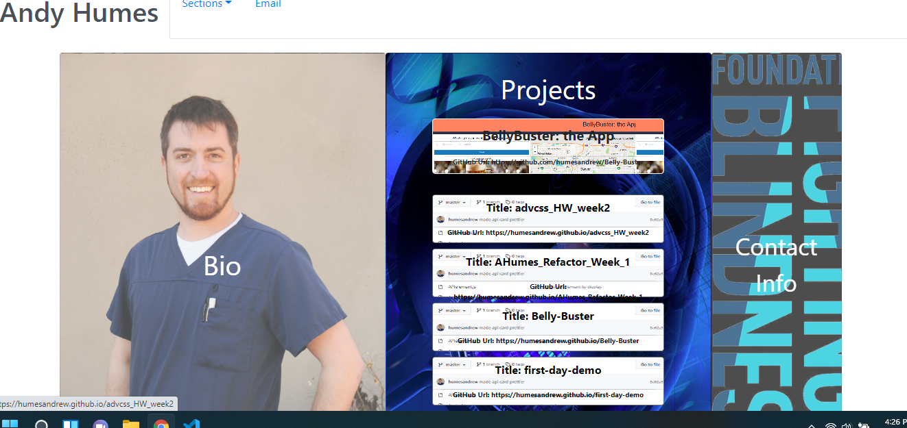

Description: this is an updated portfolio of my work. The goal of the page is to show my coding capability, to reference examples of my work, and to also act as my contact page for the Foundation Fighting Blindness. The deployed application covers all of the requirements requested. The page is adaptive, as it adjusts the display based on your screen size. The page is interactive, in that clicking elements either changes the dispay or sends you to the link. 

Usage: 

Credits: 
I used bootstrap for the framework. I used images from my publication in EyeNet Magazine, as well as the logo for the Foundation Fighting Blindness. 